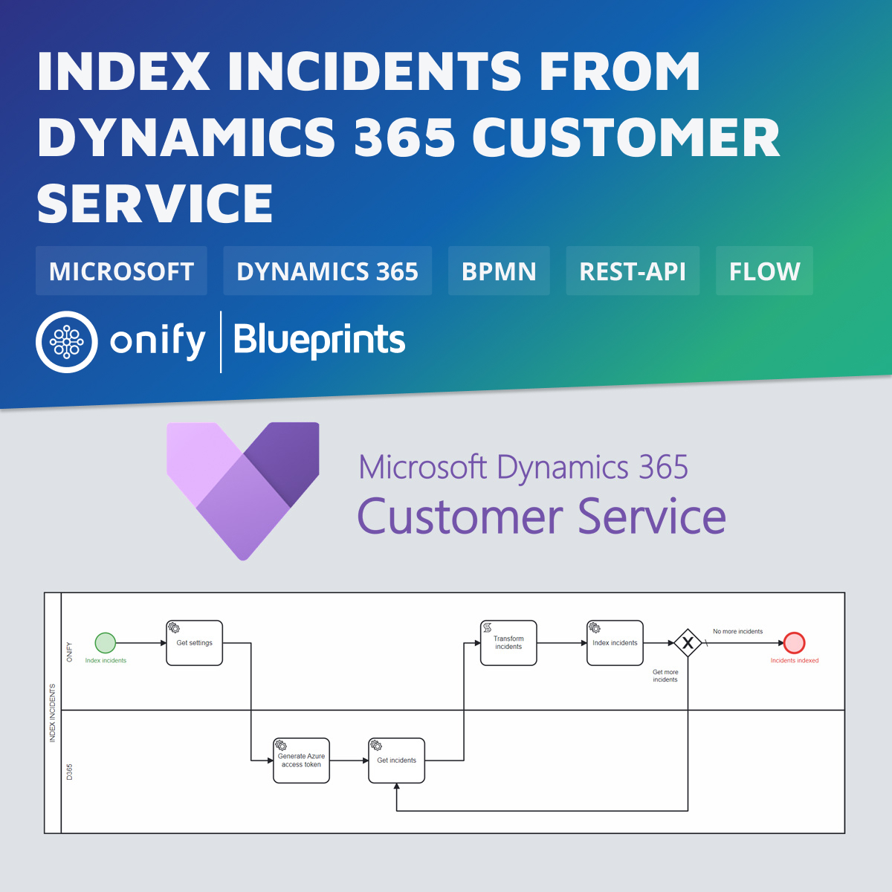

[](https://www.repostatus.org/#wip)


# Onify Blueprint:Index incidents from Dynamics 365 Customer Service

[Microsoft Dynamics 365 Customer Service](https://dynamics.microsoft.com/customer-service/overview/) is a module for customer service automation that streamlines case and knowledge management, enables personalized customer service with a 360-degree customer view, and provides visibility into customer service department performance with dashboards and reports.

In this Blueprint we index all incidents from Dynamics 365 Customer Service using REST-API integration.



## Requirements

* [Onify Hub](https://github.com/onify/install)
* [Camunda Modeler](https://camunda.com/download/modeler/)
* [Dynamics 365 Customer Service](https://dynamics.microsoft.com/customer-service/overview/)

## Included

* 1 x Flow

## Setup

### Microsoft

There are 2 parts to this setup

1. App registration (Registering an App in Active Directory). Please follow [these instructions](https://d365demystified.com/2022/03/06/setup-postman-to-connect-to-dynamics-365-crm-using-oauth-2-0-azure-app-registration/), section *Register an App in Azure* ( name the app `Onify Web API` instead ;-) )
2. Add CRM application user
   1. Go to `https://admin.powerplatform.microsoft.com/environments/<ENVIRONMENTID>/appusers` (where `<ENVIRONMENTID>` is your Dynamics 365 CRM environment id)
   2. Add your newly created app as a app user (and add appropriate security roles)

### Onify

Add the following settings.

|Key|Name|Value|Type|Tag|Role|
|---|----|-----|----|---|----|
|azure_credentials|Microsoft Azure credentials|``` { "tenant": "<TENANTID>", "client_id": "<CLIENTID>",	"client_secret": "<CLIENTSECRET>"}```|object|dynamics365, frontend|admin|
|dynamics365_url|Dynamics 365 CRM url|`https://<ORGID>.<CRMNR>.dynamics.com`|string|dynamics365, frontend|admin|

> Note: Creating settings via admin interface add a trailing `_` in key. This is required for flow to work.

## Test

1. Open the BPMN diagram in Camunda Modeler.
2. Update `headers.Prefer` and `odata.maxpagesize` (Get incidents task) to preferred value (optional)
3. Update script in Transform incidents tasks (optional)
3. Deploy the BPMN diagram (click `Deploy current diagram` and follow the steps).
4. Run it (click `Start current diagram`).

> Note: To be able to search for dates and other types of fields we also need to update attribute mappings in Elasticsearch. Please contact support@onify.co for more information.

## Support

* Community/forum: https://support.onify.co/discuss
* Documentation: https://support.onify.co/docs
* Support and SLA: https://support.onify.co/docs/get-support

## License

This project is licensed under the MIT License - see the [LICENSE](LICENSE) file for details.

## Contributors

Thanks [Tony Aronsson](https://github.com/Aronsson84) @ [Zitac](https://github.com/zitacconsulting) for the support.